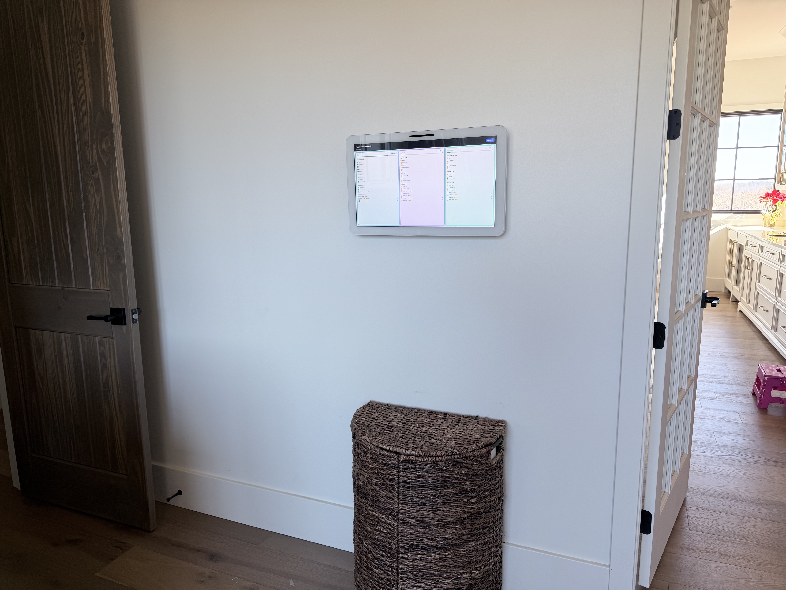
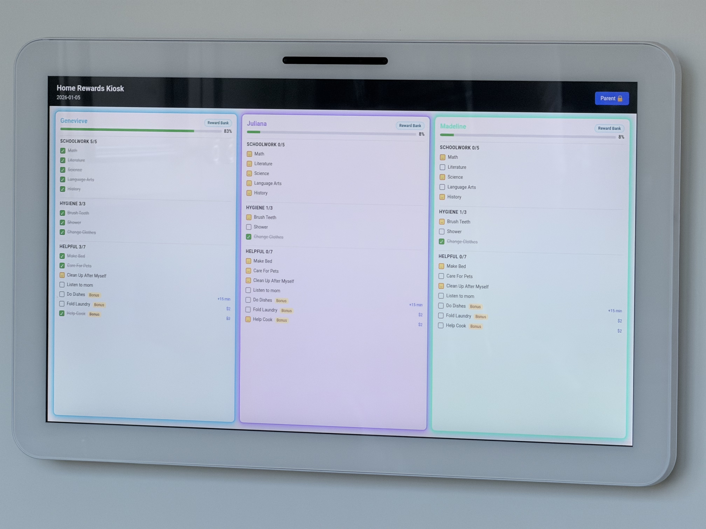

# Home Rewards Kiosk

A local-only, wall-mounted kiosk checklist for children to understand their daily requirements and unlock rewards. It runs on a LAN and is designed for a fixed 1920×1080 touch display with **no scrolling**.   This is because it was initially designed to run on the Ubiquiti / UniFi Connect kiosk touchscreen. However, it will run on any screen that supports 1920x1080 and doesn't have to be touchbased. 

## Features

- Up to 5 child columns with Schoolwork, Hygiene, and Helpful categories.
- Child taps mark tasks as **Pending** until a parent approves or rejects.
- Parent-only approvals and editing behind a PIN.
- Weekday/Weekend templates with automatic midnight reset.
- Bonus tasks show reward text but never block unlock.
- **Custom colors per child**: name color + card glow/gradient styling.
- **Progress bars** count only REQUIRED tasks (bonus tasks excluded).
- **Today tab**: create one-off tasks for the day.
- **Reward Bank**: bonus task approvals automatically add reward entries (formatted as "Task: Reward").
- **Reward claims**: kids request rewards; parents approve/deny in admin panel.
- **Sort order**: control display position of tasks within each category.
- **Completed tasks tab**: view and revoke approvals if needed.




## Run Locally

1. Install dependencies:

```bash
python -m venv .venv
source .venv/bin/activate
pip install -r requirements.txt
```

2. Start the server:

```bash
uvicorn app.main:app --reload --host 0.0.0.0 --port 8000
```

3. Open the kiosk view in a browser on the LAN:

```
http://<your-lan-ip>:8000/
```

## Parent PIN

The default Parent PIN is `1234`. To change it:

1. Click **Parent 🔒** in the kiosk UI.
2. Enter the current PIN.
3. Open the **Settings** tab and set a new PIN.

> You can also set a secret for tokens with the `KIOSK_SECRET_KEY` environment variable.


## Parent Admin Panel Tabs

- **Approvals**: Review pending tasks from all children; approve or reject.
- **Completed**: View approved tasks; revoke if needed.
- **Today**: Create/edit/delete one-time tasks for today (optional; templates auto-generate daily).
- **Templates**: Manage recurring Weekday and Weekend tasks. Set required/bonus, reward text, and sort order.
- **Settings**: 
  - Edit child names and colors
  - Add/remove children (up to 5 max)
  - Change daily reward unlock text
  - Update parent PIN

## Using Colors

Each child can pick a color in Settings. The color appears on:
- The child's name on the main kiosk display.
- A subtle glow and gradient tint on their task card.

## Progress & Unlock

- Progress bars show the percentage of **required tasks** completed.
- Bonus tasks never affect the progress bar or unlock status.
- When all required tasks are approved, the child's card shows **"PLAYTIME UNLOCKED ✅"** and the configured reward text.

## Layout / No Scrolling

The UI is designed for **1920×1080** and enforces `overflow: hidden` on the page.
Keep task lists short (around 10–12 items per child) to maintain the no-scroll layout.

## Reward Bank

- Approving a bonus task automatically creates a **reward entry** for that child.
- Rewards display as **"Task Title: Reward"** (e.g., "Do Dishes: +15 min").
- Children can view their reward bank and tap **"Request"** to claim a reward.
- Parents see pending requests in the **Rewards** tab and can approve or deny.
- Once approved, the reward shows a **✓ Claimed** checkmark.


## Sort Order

Sort order is not imperitive, you can skip paying attention to it if you wish. It is optional if you wish for some items to be towards the top or bottom. 

When creating or editing tasks (Today or Templates), you can set a `sort_order` value:
- Tasks are sorted **within their category** by sort_order (lowest first).
- Example: if Schoolwork has tasks with sort_order 1, 2, 3, they appear in that order.
- Allows fine control over task presentation.

